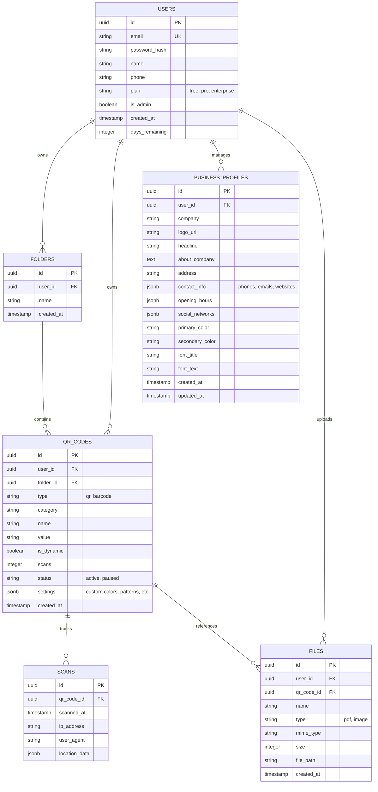

# Database Schema Design - QR Pro Studio

This document defines the relational database schema for the QR Maker platform. The schema is designed to be implemented in **PostgreSQL**, utilizing `JSONB` for flexible configuration storage where appropriate.

## Entity Relationship Diagram



## SQL Definitions (PostgreSQL)

### Users Table
```sql
CREATE TABLE users (
    id UUID PRIMARY KEY DEFAULT gen_random_uuid(),
    email VARCHAR(255) UNIQUE NOT NULL,
    password_hash VARCHAR(255) NOT NULL,
    name VARCHAR(100),
    phone VARCHAR(20),
    plan VARCHAR(20) DEFAULT 'free',
    is_admin BOOLEAN DEFAULT FALSE,
    created_at TIMESTAMP WITH TIME ZONE DEFAULT CURRENT_TIMESTAMP,
    days_remaining INTEGER DEFAULT 0
);
```

### Folders Table
```sql
CREATE TABLE folders (
    id UUID PRIMARY KEY DEFAULT gen_random_uuid(),
    user_id UUID REFERENCES users(id) ON DELETE CASCADE,
    name VARCHAR(100) NOT NULL,
    created_at TIMESTAMP WITH TIME ZONE DEFAULT CURRENT_TIMESTAMP
);
```

### QR Codes Table
```sql
CREATE TABLE qr_codes (
    id UUID PRIMARY KEY DEFAULT gen_random_uuid(),
    user_id UUID REFERENCES users(id) ON DELETE CASCADE,
    folder_id UUID REFERENCES folders(id) ON DELETE SET NULL,
    type VARCHAR(20) NOT NULL, -- qr, barcode
    category VARCHAR(50) NOT NULL,
    name VARCHAR(255),
    value TEXT NOT NULL,
    is_dynamic BOOLEAN DEFAULT FALSE,
    scans INTEGER DEFAULT 0,
    status VARCHAR(20) DEFAULT 'active',
    settings JSONB, -- Stores complex styling and configuration
    created_at TIMESTAMP WITH TIME ZONE DEFAULT CURRENT_TIMESTAMP
);
```

### Business Profiles Table
```sql
CREATE TABLE business_profiles (
    id UUID PRIMARY KEY DEFAULT gen_random_uuid(),
    user_id UUID REFERENCES users(id) ON DELETE CASCADE,
    company VARCHAR(255),
    logo_url TEXT,
    headline VARCHAR(255),
    about_company TEXT,
    address TEXT,
    contact_info JSONB, -- phones, emails, websites
    opening_hours JSONB,
    social_networks JSONB,
    primary_color VARCHAR(20),
    secondary_color VARCHAR(20),
    font_title VARCHAR(100),
    font_text VARCHAR(100),
    created_at TIMESTAMP WITH TIME ZONE DEFAULT CURRENT_TIMESTAMP,
    updated_at TIMESTAMP WITH TIME ZONE DEFAULT CURRENT_TIMESTAMP
);
```

### Scans Table
```sql
CREATE TABLE scans (
    id UUID PRIMARY KEY DEFAULT gen_random_uuid(),
    qr_code_id UUID REFERENCES qr_codes(id) ON DELETE CASCADE,
    scanned_at TIMESTAMP WITH TIME ZONE DEFAULT CURRENT_TIMESTAMP,
    ip_address VARCHAR(45),
    user_agent TEXT,
    location_data JSONB
);
```

### Files Table
```sql
CREATE TABLE files (
    id UUID PRIMARY KEY DEFAULT gen_random_uuid(),
    user_id UUID REFERENCES users(id) ON DELETE CASCADE,
    qr_code_id UUID REFERENCES qr_codes(id) ON DELETE SET NULL,
    name VARCHAR(255) NOT NULL,
    type VARCHAR(20) NOT NULL, -- pdf, image
    mime_type VARCHAR(100),
    size INTEGER,
    file_path TEXT NOT NULL,
    created_at TIMESTAMP WITH TIME ZONE DEFAULT CURRENT_TIMESTAMP
);
```
